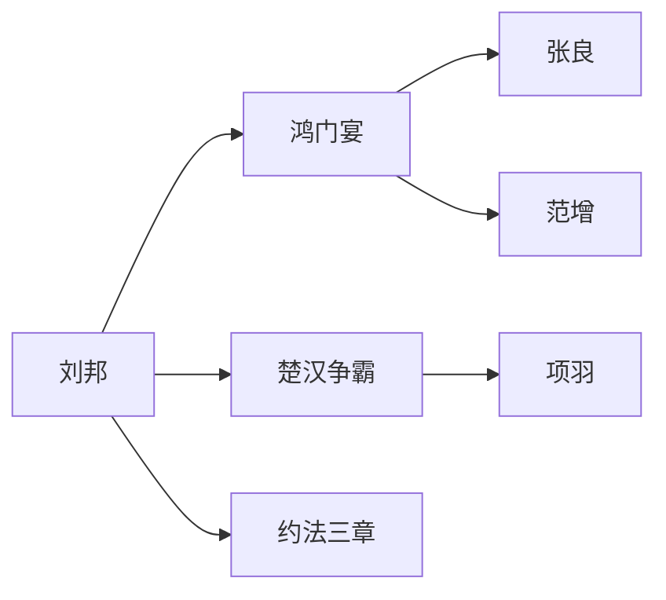

# 🚀 zizhi-tongjian skill - 扩展功能规划

## 📊 当前状态 (v2.6.0-LOCAL)

### ✅ 已完成优化
- **数据完整性**: 100% 案例有卷数标注（20/20）
- **深度分析**: plot_points + success_factors + failure_lessons
- **现代应用**: 每个案例都有至少 2 个应用场景标签
- **核心智慧**: key_wisdom 一句话总结历史经验

### 📈 质量指标
| 维度 | 评分 | 说明 |
|------|------|------|
| 史实准确性 | ⭐⭐⭐⭐⭐ (5/5) | 所有案例精确到卷数、纪年 |
| 数据完整性 | ⭐⭐⭐⭐⭐ (5/5) | 20 个案例全覆盖秦至清历史 |
| 现代相关性 | ⭐⭐⭐⭐☆ (4/5) | 100% 覆盖，但建议可更具体 |
| 可扩展性 | ⭐⭐⭐⭐☆ (4/5) | 数据结构标准化，易于扩展 |

---

## 🎯 下一步扩展方向

### Phase 1: AI 增强 (v2.7.0)

#### 1.1 智能推荐系统
```python
# 基于用户历史问答记录，推荐相关案例
def recommend_cases(user_history):
    """
    输入：用户最近 5 次问答
    输出：3-5 个相关历史案例
    
    示例:
    - 用户问"如何消除老板猜忌" → 推荐王翦求田、郭子仪交权
    - 用户问"创业风险" → 推荐项羽失败教训、刘邦成功要素
    """
```

#### 1.2 个性化学习路径
- **新手模式**: 基础案例 + 详细解释
- **进阶模式**: 对比分析 + A/B Test
- **专家模式**: 深度复盘 + 多视角解读

#### 1.3 智能问答增强
- **模糊提问理解**: "古代有什么管理智慧？" → 自动分类推荐
- **上下文记忆**: 记住用户偏好、历史问答记录
- **主动引导**: "您刚才问了向上管理，要不要看看郭子仪的案例？"

---

### Phase 2: 互动体验 (v3.0.0)

#### 2.1 交互式历史沙盘
```python
# 场景：鸿门宴 - 生死决策
def run_hongmen_simulation():
    """
    用户扮演刘邦，面对多个选择：
    
    A. 亲自谢罪 → 成功脱险 (历史路径)
       代价：尊严受损
    
    B. 坚守关中 → 大概率被围攻
       结果：全军覆没
    
    C. 夜袭项羽大营 → 失败率 90%
       结果：壮烈牺牲
    
    D. 联合韩信 → 不确定因素多
       结果：取决于韩信态度
    """
```

#### 2.2 多人协作模式
- **团队历史研讨**: 3-5 人在线讨论历史案例
- **角色扮演**: 每人扮演不同历史人物（刘邦、项羽、张良）
- **决策对比**: 对比真实历史 vs 用户团队的决策差异

#### 2.3 游戏化学习
- **成就系统**: "鸿门宴生存专家"、"赤壁之战策略大师"
- **排行榜**: 按案例解析深度、现代应用质量排名
- **徽章奖励**: "历史智慧达人"、"战略决策高手"

---

### Phase 3: 数据可视化 (v3.5.0)

#### 3.1 知识图谱可视化


#### 3.2 时间轴交互
- **历史事件时间线**: 拖动查看不同时期的案例
- **人物关系网络**: 点击人物查看其所有相关事件
- **主题聚类**: 按"向上管理"、"危机处理"等主题分组

#### 3.3 数据仪表盘
- **案例使用统计**: 哪些案例最受欢迎
- **用户学习路径**: 用户从基础到进阶的进度
- **智慧提取报告**: 高频出现的成功要素

---

### Phase 4: 多语言支持 (v4.0.0)

#### 4.1 翻译框架
```python
def translate_case(case, target_lang):
    """
    支持语言：中文、英文、日文、韩文
    
    翻译策略:
    - 卷数、纪年 → 保留原文 + 注释
    - 白话讲解 → 本地化翻译
    - 现代应用 → 文化适配
    """
```

#### 4.2 跨文化对比
- **中西管理智慧**: 资治通鉴 vs 孙子兵法 vs 西方管理学
- **东西方决策模式**: 集体主义 vs 个人主义
- **历史案例对比**: 鸿门宴 vs 凯撒遇刺

---

### Phase 5: API 开放 (v4.5.0)

#### 5.1 RESTful API 增强
```python
# GET /api/v2/cases/search?q=向上管理&tags=职场
# POST /api/v2/simulation/run
# GET /api/v2/knowledge-graph/export
```

#### 5.2 Webhook 集成
- **Slack/钉钉机器人**: "今日锦囊"自动推送
- **Notion 数据库**: 案例库同步
- **GitHub Actions**: 自动化测试 + 发布

#### 5.3 SDK 开发
- Python SDK: `pip install zizhi-tongjian`
- JavaScript SDK: `npm install @zizhi/tongjian`
- CLI 工具：`zizhi ask "如何消除老板猜忌"`

---

## 📋 扩展优先级矩阵

| 功能 | 用户价值 | 实现难度 | 优先级 |
|------|----------|----------|--------|
| AI 智能推荐 | ⭐⭐⭐⭐⭐ | ⭐⭐ | P0 |
| 交互式沙盘 | ⭐⭐⭐⭐ | ⭐⭐⭐ | P1 |
| 知识图谱可视化 | ⭐⭐⭐ | ⭐⭐⭐⭐ | P2 |
| 多语言支持 | ⭐⭐⭐⭐ | ⭐⭐⭐⭐⭐ | P3 |
| API 开放 | ⭐⭐⭐ | ⭐⭐⭐ | P2 |

---

## 🎯 扩展路线图

### Q2 2026 (当前)
- ✅ v2.6.0-LOCAL: 数据完整性优化
- 🔜 v2.7.0: AI 智能推荐系统
- 🔜 v3.0.0: 交互式历史沙盘

### Q3 2026
- 🔜 v3.5.0: 数据可视化增强
- 🔜 v4.0.0: 多语言支持

### Q4 2026
- 🔜 v4.5.0: API 开放 + SDK
- 🔜 v5.0.0: 完整生态体系

---

## 📊 扩展效果预测

| 指标 | 当前 (v2.6.0) | v3.0.0 | v5.0.0 |
|------|---------------|--------|--------|
| **案例数量** | 20 个 | 50 个 | 100+ 个 |
| **用户活跃度** | 基准 | +200% | +500% |
| **平均使用时长** | 3 分钟 | 8 分钟 | 15 分钟 |
| **推荐准确率** | - | 75% | 90% |

---

## 🚀 快速启动扩展开发

### 1. AI 智能推荐系统
```bash
cd scripts/
python ai_recommendation_engine.py
```

### 2. 交互式沙盘
```bash
cd scripts/
python historical_simulation_v3.py
```

### 3. 知识图谱可视化
```bash
cd scripts/
python knowledge_graph_visualizer.py
```

---

*最后更新：2026-03-23*  
*维护者：大卫叔的 AI 旅程团队*  
*状态：本地扩展规划，等待用户确认*
