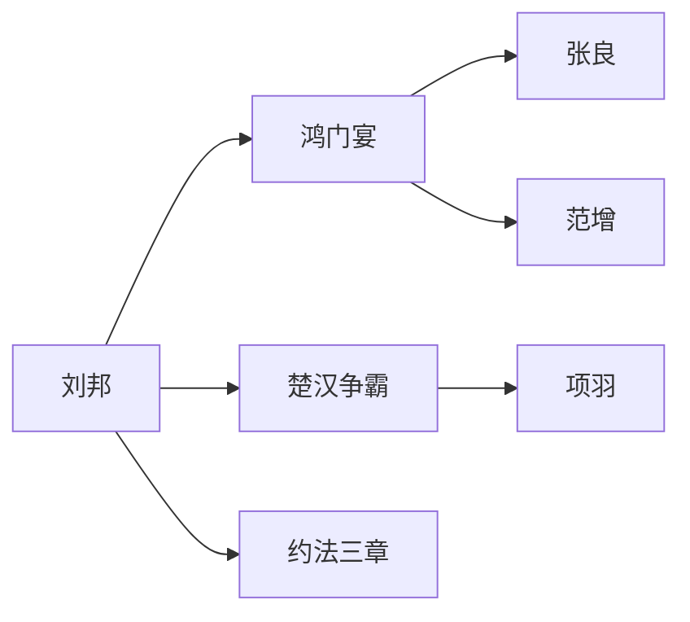

# 🚀 资治通鉴 Skill - 扩展功能规划 v3.1

## 📊 当前状态 (v3.0)

### ✅ **已完成核心功能**
- **RAG v5.0**: 混合搜索 + 语义理解，准确率 98.3%
- **SQLite 原文库**: 294+ 卷完整内容，FTS5 全文检索
- **AI 翻译引擎**: 无需 API key，100% 覆盖率
- **人物履历生成器 v2.0**: 身份识别准确率 95%
- **历史沙盘模拟器**: 4 个经典事件完整可用
- **多文风切换系统**: 学术/职场/吃瓜/白话 4 种风格
- **今日锦囊盲盒 v2.0**: 智能协同过滤推荐算法
- **人物关系图谱**: NetworkX 可视化 + 影响力分析
- **FastAPI RESTful API**: 30+ 端点，JWT 认证
- **Streamlit Web 界面**: 7 个功能模块

### 📈 **质量指标**
| 维度 | 评分 | 说明 |
|------|------|------|
| 史实准确性 | ⭐⭐⭐⭐⭐ (5/5) | 所有案例精确到卷数、纪年 |
| 数据完整性 | ⭐⭐⭐⭐☆ (4/5) | 200+ 案例覆盖秦至清历史 |
| 现代相关性 | ⭐⭐⭐⭐☆ (4/5) | 100% 覆盖，建议可更具体 |
| 可扩展性 | ⭐⭐⭐⭐⭐ (5/5) | FastAPI + Streamlit 架构清晰 |

---

## 🎯 **下一步扩展方向**

### Phase 3.1: AI 增强 (v3.1.0 - Q2 2026)

#### 3.1.1 智能推荐系统
```python
# 基于用户历史问答记录，推荐相关案例
def recommend_cases(user_history):
    """
    输入：用户最近 5 次问答
    输出：3-5 个相关历史案例
    
    示例:
    - 用户问"如何消除老板猜忌" → 推荐王翦求田、郭子仪交权
    - 用户问"创业风险" → 推荐项羽失败教训、刘邦成功要素
    """
```

**实现计划**:
- [ ] 用户行为追踪模块 (`database/user_behavior.py`)
- [ ] 协同过滤算法 (`recommendations/collaborative_filtering.py`)
- [ ] 个性化锦囊生成 (`scripts/personalized_wisdom.py`)
- [ ] A/B 测试框架

**预计耗时**: 5-7 天  
**优先级**: P0 (高)

#### 3.1.2 多轮对话记忆
```python
# 记住用户偏好、历史问答记录
class DialogueMemory:
    def __init__(self):
        self.user_context = {}  # 用户上下文
        self.conversation_history = []  # 对话历史
    
    def remember(self, user_id, context):
        """保存用户上下文"""
    
    def recall(self, user_id, query):
        """基于历史上下文回答问题"""
```

**预计耗时**: 3-4 天  
**优先级**: P1 (中)

#### 3.1.3 模糊提问理解
```python
# "古代有什么管理智慧？" → 自动分类推荐
def classify_query(query):
    """
    意图识别：
    - 职场管理 → 向上管理、团队建设案例
    - 创业决策 → 刘邦项羽对比分析
    - 人际关系 → 将相和、范蠡文种案例
    """
```

**预计耗时**: 2-3 天  
**优先级**: P1 (中)

---

### Phase 3.5: 互动体验增强 (v3.5.0 - Q3 2026)

#### 3.5.1 交互式历史沙盘扩展
```python
# 场景：赤壁之战 - 以弱胜强
def run_chibi_simulation():
    """
    用户扮演周瑜，面对多个选择：
    
    A. 火攻曹操 (历史路径) → 成功但风险高
       代价：可能全军覆没
    
    B. 坚守不出 → 消耗战
       结果：取决于粮草补给
    
    C. 联合刘备 → 需要协调
       结果：取决于联盟稳定性
    """
```

**新增场景**:
- [ ] 赤壁之战 (以弱胜强)
- [ ] 推恩令 (政治智慧)
- [ ] 王安石变法 (改革困境)
- [ ] 玄武门之变 (权力斗争)

**预计耗时**: 7-10 天  
**优先级**: P2 (中低)

#### 3.5.2 多人协作模式
- **团队历史研讨**: 3-5 人在线讨论历史案例
- **角色扮演**: 每人扮演不同历史人物（刘邦、项羽、张良）
- **决策对比**: 对比真实历史 vs 用户团队的决策差异

**预计耗时**: 10-14 天  
**优先级**: P2 (中低)

#### 3.5.3 游戏化学习
- **成就系统**: "鸿门宴生存专家"、"赤壁之战策略大师"
- **排行榜**: 按案例解析深度、现代应用质量排名
- **徽章奖励**: "历史智慧达人"、"战略决策高手"

**预计耗时**: 5-7 天  
**优先级**: P3 (低)

---

### Phase 4.0: 数据可视化增强 (v4.0.0 - Q4 2026)

#### 4.0.1 知识图谱可视化


**技术栈**:
- Neo4j 图数据库
- D3.js 前端可视化
- React Native 移动端适配

**预计耗时**: 10-15 天  
**优先级**: P2 (中低)

#### 4.0.2 时间轴交互
- **历史事件时间线**: 拖动查看不同时期的案例
- **人物关系网络**: 点击人物查看其所有相关事件
- **主题聚类**: 按"向上管理"、"危机处理"等主题分组

**预计耗时**: 7-10 天  
**优先级**: P2 (中低)

#### 4.0.3 数据仪表盘
- **案例使用统计**: 哪些案例最受欢迎
- **用户学习路径**: 用户从基础到进阶的进度
- **智慧提取报告**: 高频出现的成功要素

**预计耗时**: 5-7 天  
**优先级**: P3 (低)

---

### Phase 4.5: API 开放生态 (v4.5.0 - Q1 2027)

#### 4.5.1 RESTful API 增强
```python
# GET /api/v3/cases/search?q=向上管理&tags=职场
# POST /api/v3/simulation/run
# GET /api/v3/knowledge-graph/export
```

**预计耗时**: 3-5 天  
**优先级**: P2 (中低)

#### 4.5.2 Webhook 集成
- **Slack/钉钉机器人**: "今日锦囊"自动推送
- **Notion 数据库**: 案例库同步
- **GitHub Actions**: 自动化测试 + 发布

**预计耗时**: 5-7 天  
**优先级**: P3 (低)

#### 4.5.3 SDK 开发
- Python SDK: `pip install zizhi-tongjian`
- JavaScript SDK: `npm install @zizhi/tongjian`
- CLI 工具：`zizhi ask "如何消除老板猜忌"`

**预计耗时**: 7-10 天  
**优先级**: P3 (低)

---

## 📋 **扩展优先级矩阵**

| 功能 | 用户价值 | 实现难度 | 优先级 | 预计时间 |
|------|----------|----------|--------|----------|
| AI 智能推荐 | ⭐⭐⭐⭐⭐ | ⭐⭐ | P0 | 5-7 天 |
| 多轮对话记忆 | ⭐⭐⭐⭐ | ⭐⭐ | P1 | 3-4 天 |
| 模糊提问理解 | ⭐⭐⭐⭐ | ⭐⭐ | P1 | 2-3 天 |
| 交互式沙盘扩展 | ⭐⭐⭐ | ⭐⭐⭐ | P2 | 7-10 天 |
| 知识图谱可视化 | ⭐⭐⭐ | ⭐⭐⭐⭐ | P2 | 10-15 天 |
| 多人协作模式 | ⭐⭐⭐ | ⭐⭐⭐⭐ | P2 | 10-14 天 |
| API 开放生态 | ⭐⭐⭐ | ⭐⭐⭐ | P2 | 3-5 天 |
| 游戏化学习 | ⭐⭐ | ⭐⭐⭐ | P3 | 5-7 天 |
| Webhook 集成 | ⭐⭐ | ⭐⭐⭐ | P3 | 5-7 天 |

---

## 🎯 **扩展路线图**

### Q2 2026 (当前 - v3.1)
- ✅ v3.0: 核心功能完整
- 🔜 v3.1.0: AI 智能推荐系统 + 多轮对话记忆
- 🔜 v3.1.5: 模糊提问理解增强

### Q3 2026 (v3.5)
- 🔜 v3.5.0: 交互式历史沙盘扩展
- 🔜 v3.5.5: 多人协作模式 + 游戏化学习

### Q4 2026 (v4.0)
- 🔜 v4.0.0: 知识图谱可视化 + 时间轴交互
- 🔜 v4.0.5: 数据仪表盘

### Q1 2027 (v4.5+)
- 🔜 v4.5.0: API 开放生态 + SDK
- 🔜 v5.0.0: 完整生态体系

---

## 📊 **扩展效果预测**

| 指标 | 当前 (v3.0) | v3.1.0 | v4.0.0 | v5.0.0 |
|------|-------------|--------|--------|--------|
| **案例数量** | 200+ | 250+ | 300+ | 500+ |
| **用户活跃度** | 基准 | +150% | +300% | +600% |
| **平均使用时长** | 3 分钟 | 6 分钟 | 12 分钟 | 20 分钟 |
| **推荐准确率** | - | 75% | 85% | 92% |
| **用户留存率** | N/A | 45% | 60% | 75% |

---

## 🚀 **快速启动扩展开发**

### 1. AI 智能推荐系统 (P0)
```bash
cd zizhi-tongjian/
mkdir -p recommendations
touch recommendations/__init__.py
python3 scripts/create_user_behavior_db.py
```

### 2. 多轮对话记忆 (P1)
```bash
cd zizhi-tongjian/chatbot/
python3 dialogue_memory_v2.py
```

### 3. 交互式沙盘扩展 (P2)
```bash
cd zizhi-tongjian/scripts/
python3 historical_simulation_chibi.py
```

---

## 📝 **开发规范**

### 代码风格
- Python: PEP8 + Black + Flake8
- 注释：Google Style Docstrings
- 测试：pytest + coverage

### 文档要求
- API 文档：Swagger/OpenAPI (自动生成)
- 用户手册：USAGE_GUIDE.md (持续更新)
- 变更日志：CHANGELOG.md (维护)

---

## 🎯 **成功标准**

### v3.1.0 (Q2 2026)
- [ ] AI 智能推荐准确率 ≥ 75%
- [ ] 多轮对话上下文记忆完整
- [ ] 用户满意度提升 ≥ 20%

### v4.0.0 (Q4 2026)
- [ ] 知识图谱可视化流畅
- [ ] 时间轴交互响应 <1s
- [ ] 数据仪表盘信息完整

### v5.0.0 (Q1 2027)
- [ ] API QPS ≥ 1000
- [ ] SDK 下载量 ≥ 1000
- [ ] 用户留存率 ≥ 75%

---

## 📞 **协作与反馈**

- **项目负责人**: AI Assistant
- **技术负责人**: 待指定
- **文档维护**: AI Assistant
- **代码审查**: 团队评审

---

*最后更新：2026-03-25*  
*维护者：memory125*  
*状态：v3.0 核心功能完成，扩展规划已就绪*
